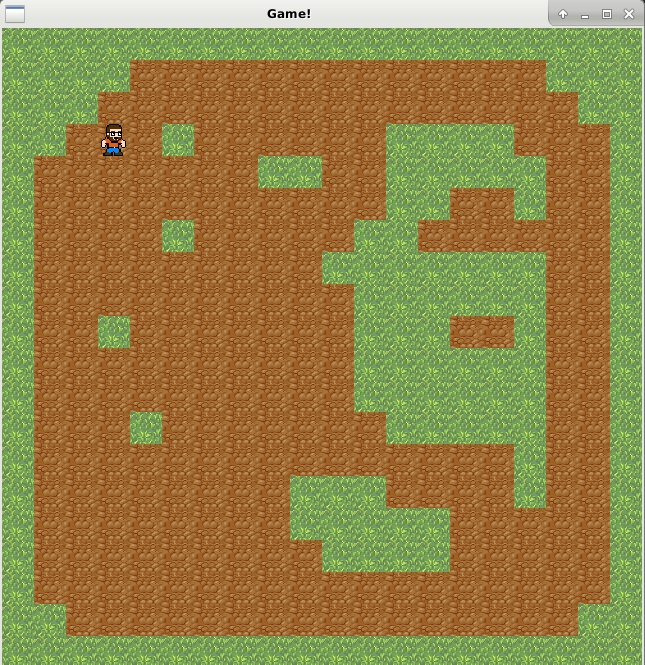

# What this?
-------------

  * Small game in C++ and SFML.

In front of the player is a ``field'` card. You need to sow the lawn in the ground.
You can not walk on the planted lawn. You need to sow the whole field.

TODO:
1) ~~Dynamic map generation.~~
2) Checking the map for the possibility of passing it according to the rules of the game.
3) Interactive game over (you can start the game again)

